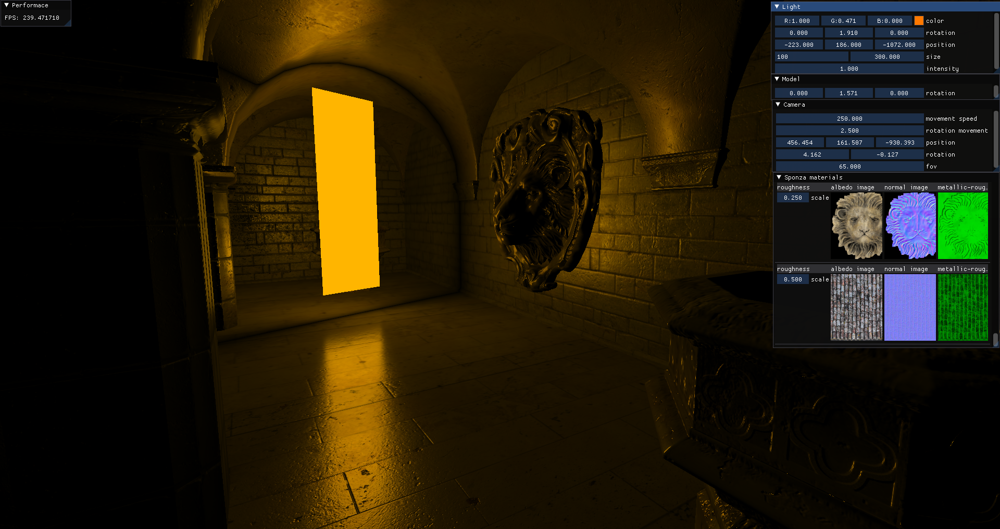

# VulkanAbstractionLayer

WIP library for abstracting Vulkan API to later use in my projects (including [MxEngine](https://github.com/asc-community/MxEngine))


## Installation
1. clone to your system using: `git clone --recurse-submodules https://github.com/vkdev-team/VulkanAbstractionLayer`
2. make sure you have Vulkan SDK installed (Vulkan 1.2 is recommended)
3. build examples by running main `CMakeLists.txt`

If you want to use the library in your CMake project:
```cmake
add_subdirectory(VulkanAbstractionLayer)
target_include_directories(TARGET PUBLIC ${VULKAN_ABSTRACTION_LAYER_INCLUDE_DIR})
target_link_libraries(TARGET PUBLIC VulkanAbstractionLayer)
```

## Minimal example
```cpp
#include "VulkanAbstractionLayer/Window.h"
#include "VulkanAbstractionLayer/VulkanContext.h"

using namespace VulkanAbstractionLayer;

int main()
{
    WindowCreateOptions windowOptions;
    windowOptions.Position = { 300.0f, 100.0f };
    windowOptions.Size = { 1280.0f, 720.0f };

    Window window(windowOptions);

    VulkanContextCreateOptions vulkanOptions;
    vulkanOptions.VulkanApiMajorVersion = 1;
    vulkanOptions.VulkanApiMinorVersion = 2;
    vulkanOptions.Extensions = window.GetRequiredExtensions();
    vulkanOptions.Layers = { "VK_LAYER_KHRONOS_validation" };

    VulkanContext Vulkan(vulkanOptions);
    SetCurrentVulkanContext(Vulkan);

    ContextInitializeOptions deviceOptions;
    deviceOptions.PreferredDeviceType = DeviceType::DISCRETE_GPU;

    Vulkan.InitializeContext(window.CreateWindowSurface(Vulkan), deviceOptions);

    window.OnResize([&Vulkan](Window& window, Vector2 size) mutable
    { 
        Vulkan.RecreateSwapchain((uint32_t)size.x, (uint32_t)size.y); 
    });
    
    while (!window.ShouldClose())
    {
        window.PollEvents();

        if(Vulkan.IsRenderingEnabled())
        {
            Vulkan.StartFrame();
            // rendering
            Vulkan.EndFrame();
        }
    }

    return 0;
}
```

## Render Graph
Describe RenderPass (can be abstract, not necessary containing actual shader):
```cpp
class SomeRenderPass : public RenderPass
{    
public:
    OpaqueRenderPass()
    {
        // initialization code
    }

    virtual void SetupPipeline(PipelineState pipeline) override
    {
        // load shader
        pipeline.Shader = GraphicShader{
            ShaderLoader::LoadFromSource("vertex.glsl", ShaderType::VERTEX, ShaderLanguage::GLSL),
            ShaderLoader::LoadFromSource("fragment.glsl", ShaderType::FRAGMENT, ShaderLanguage::GLSL),
        };

        // describe bindings per vertex buffer
        pipeline.VertexBindings = {
            VertexBinding{
                VertexBinding::Rate::PER_VERTEX,
                3,
            },
            VertexBinding{
                VertexBinding::Rate::PER_INSTANCE,
                2,
            },
        };

        // declare used graph resources (buffers, images, attachments) with their initial state
        pipeline.DeclareBuffer(uniformBuffer, BufferUsage::UNKNOWN);
        pipeline.DeclareImages(textures, ImageUsage::TRANSFER_DESTIONATION);
        pipeline.DeclareAttachment("Output"_id, Format::R8G8B8A8_UNORM);
        pipeline.DeclareAttachment("OutputDepth"_id, Format::D32_SFLOAT_S8_UINT);

        // describe descriptor bindings per descriptor set
        pipeline.DescriptorBindings
            .Bind(0, uniformBuffer, UniformType::UNIFORM_BUFFER)
            .Bind(1, textureSampler, UniformType::SAMPLER)
            .Bind(2, textures, UniformType::SAMPLED_IMAGE);
    }

    virtual void SetupDependencies(DependencyState depedencies) override
    {
        // describe used resources in render pass
        depedencies.AddAttachment("Output"_id, ClearColor{ 0.5f, 0.8f, 1.0f, 1.0f });
        depedencies.AddAttachment("OutputDepth"_id, ClearDepthSpencil{ });

        depedencies.AddBuffer(uniformBuffer, BufferUsage::UNIFORM_BUFFER);
        depedencies.AddImages(textures, ImageUsage::SHADER_READ);
    }
    
    virtual void OnRender(RenderPassState state) override
    {
        auto& output = state.GetOutputColorAttachment(0);
        state.Commands.SetRenderArea(output);

        // draw some stuff
    }
};
```

Build render graph from render passes:
```cpp
// some passes like ImGuiRenderPass are supported out of box

RenderGraphBuilder renderGraphBuilder;
    renderGraphBuilder
        .AddRenderPass("SomePass"_id, std::make_unique<SomeRenderPass>(sharedResources))
        .AddRenderPass("ImGuiPass"_id, std::make_unique<ImGuiRenderPass>("Output"_id))
        .SetOutputName("Output"_id);

RenderGraph renderGraph = renderGraphBuilder.Build();
```

Execute render graph each frame:
```cpp
auto& Vulkan = GetCurrentVulkanContext();

while (!window.ShouldClose())
{
    window.PollEvents();
    if (Vulkan.IsRenderingEnabled())
    {
        Vulkan.StartFrame();

        renderGraph.Execute(Vulkan.GetCurrentCommandBuffer());
        renderGraph.Present(Vulkan.GetCurrentCommandBuffer(), Vulkan.GetCurrentSwapchainImage());

        Vulkan.EndFrame();
    }
}
```

## Some Examples

*simple shadow mapping*

*area light from [LTC paper](https://eheitzresearch.wordpress.com/415-2/)*

*textured light from [LTC paper](https://eheitzresearch.wordpress.com/415-2/)*
